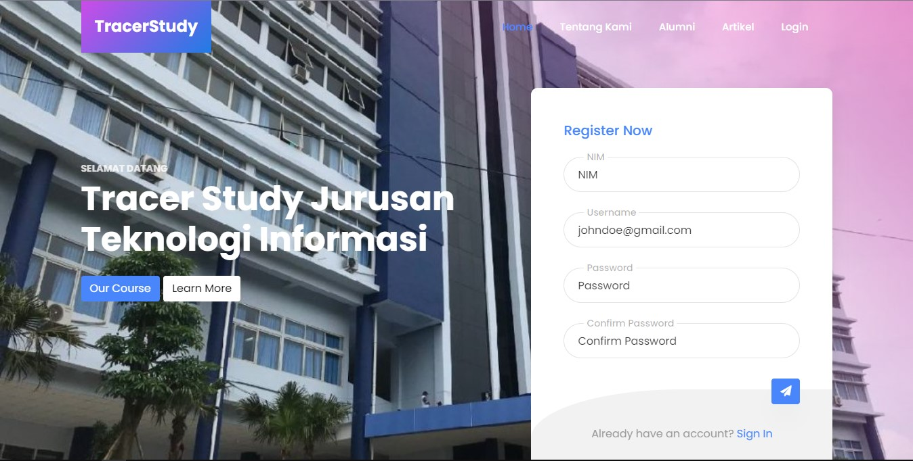
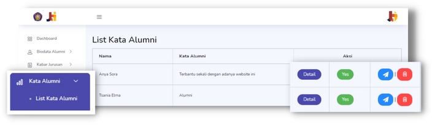
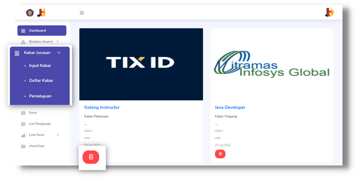
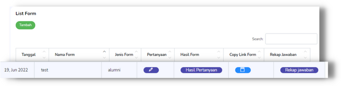
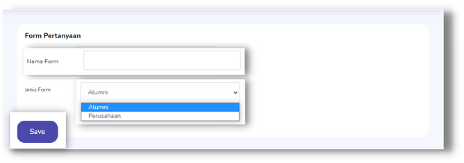
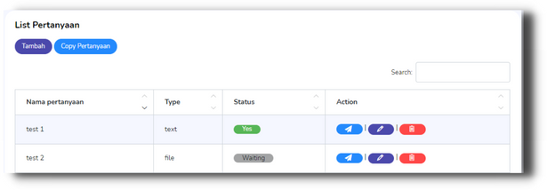
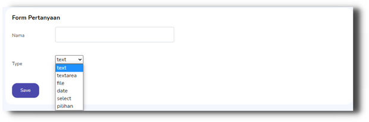
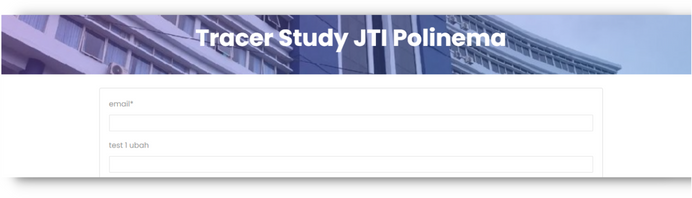

# Website Tracer Study JTI Polinema

Tracer Study JTI adalah platform untuk melacak jejak karir dan perkembangan alumni setelah lulus dari "Politekinik Negeri Malang". yang memungkinkan pihak polinema dapat membuat form sesuai dengan kebutuhan dan dapat membagikan form yang sudah dibuat ke para alumni secara otomatis. Dengan antarmuka pengguna yang ramah, pihak polinema dapat membuat, mengedit, dan menghapus pertanyaan dari form yang sudah dibuat dengan cepat dan efisien. Platform ini juga memberikan kemampuan bagi alumni untuk membagikan berita seputar pekerjaan atau magang untuk adik kelasnya.

Proyek ini dibangun dengan menggunakan Laravel, Boostrap, dan MongoDB untuk manajemen database.
## Teknologi Yang Digunakan 

Framework : Laravel, Boostrap

Database : MongoDB

## Screenshoot


















## Prasyarat

Pastikan Anda telah menginstal [Laravel](https://laravel.com/) dan [Composer](https://getcomposer.org/) di sistem Anda sebelum menjalankan proyek ini.

## Instalasi

1. Clone repositori ini:

   ```bash
   git clone https://github.com/faisal-gif/tracer_study_jti.git
   ```
   
2. Masuk ke direktori proyek:

   ```bash
   cd tracer_study_jti
   ```

3. Salin file .env.example menjadi .env dan sesuaikan pengaturan database:

   ```bash
   cp .env.example .env
   ```

4. Jalankan perintah berikut untuk menginstal dependensi:

   ```bash
   composer install
   ```

5. Install dependensi JavaScript menggunakan npm:

   ```bash
   npm install
   ```

6. Generate key aplikasi Laravel:

   ```bash
   php artisan key:generate
   ```

7. Jalankan server pengembangan Laravel

   ```bash
   php artisan serve
   ```
